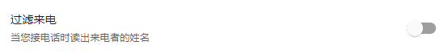
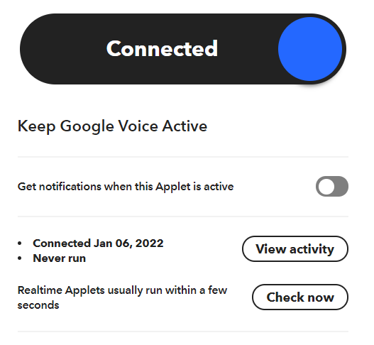
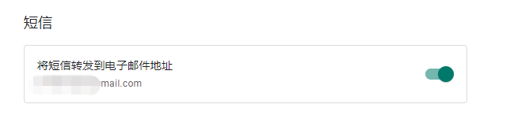
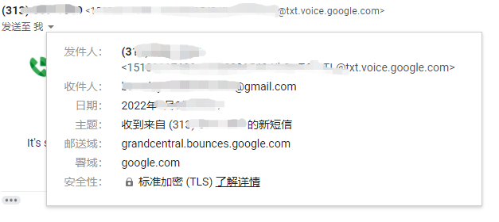
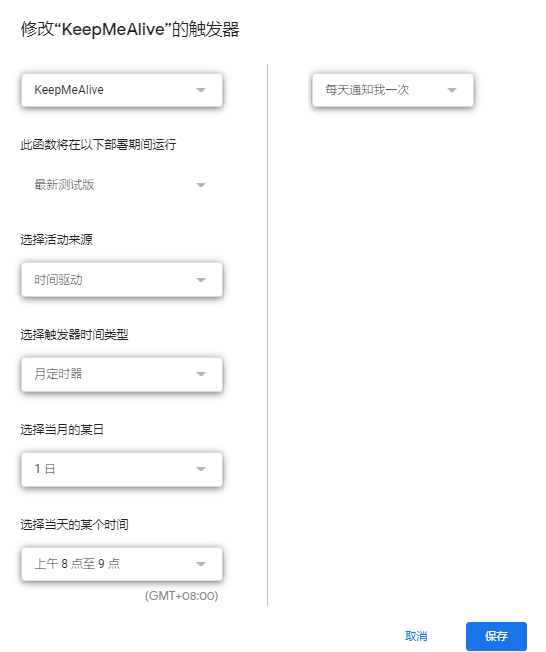
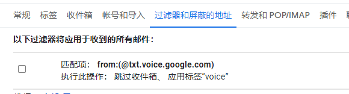
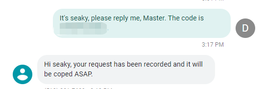

# About

要保持google voice活跃状态，有两种方法:

1、IFTTT

2、Google script


# IFTTT

IFTTT需要接听电话，打开voice.google.com，进入设置，关闭 **来电过滤 Screen calls**，不关的话可能会接不到电话



保持voice页面打开，另开窗口登陆 https://ifttt.com/home,  查找 keep google voice active。


填入号码，+1xxxxxxxxxx，确定后，voice页面会振铃，来电是英文的，会告知4个数字，重复两遍。填入验证数字后，选择日期，开通成功。




# Google Script

利用Google script互相发送消息，可以选择一个号码为serve，部署自动回复脚本，其他gv可以定时发送消息给server，并接受自动回复。


## 我的Server

如果只有一个gv，或者不想建Server，可以使用我的号码，先通过页面发送下面内容给 ‪5123379669‬，正常的话，一分钟内会收到一条回信，然后部署Client脚本。

```
The code is SeakyPass1.
```


## Client

1、在gv中设置，开启 **将短信转发到电子邮件地址 Forward messages to email**



2、server从页面发送一条消息给client

3、进入client的邮箱，会看到一条消息，记录下这个发件人地址



4、登陆 https://script.google.com/home, 新建一个项目，点1重命名为KeepMeAlive；code可以自己设一个，目的是让server识别需要自动回复的消息，如果不需要server，这个空着也行；sendto是上一步中的地址


```js
// client
function KeepMeAlive() {
  // First, checks if it isn't implemented yet.
  if (!String.prototype.format) {
    String.prototype.format = function() {
      var args = arguments;
      return this.replace(/{(\d+)}/g, function(match, number) { 
        return typeof args[number] != 'undefined' ? args[number] : match ;
      });
    };
  }
  var code = "SeakyPass1"; // 识别码
  var sendto = ""; // 消息地址
  var subject = "Good day";
  var username = Session.getEffectiveUser().getUsername();
  var body = "It's {0}, please reply me. The code is {1}.".format(username, code)
  MailApp.sendEmail(sendto, subject, body);
} 
```

5、点击运行，会提示权限，确认允许后，执行成功server端就收到到消息了


6、点击图中的6，新建触发器，设置每月1日发送消息




## Server

1、进入Gmail邮箱，添加过滤器，将 @txt.voice.google.com 的邮件标记过voice



2、进入https://script.google.com/home, 新建项目 ReplyToClient，完成后手工运行一次，授权

```js
function ReplyToClent() {
  var code = "SeakyPass1"; // Client的识别码
  var labelObj = GmailApp.getUserLabelByName('voice'); // 标签名
  var gmailThreads;
  var messages;
  var sender;
  var plainbody;
  var subject;
  var replyMsg;
  
  for (var gg = 0; gg < labelObj.getUnreadCount(); gg++) {
    gmailThreads = labelObj.getThreads()[gg];
    messages = gmailThreads.getMessages();
    for (var ii = 0; ii < messages.length; ii++) {
      if (messages[ii].isUnread()) {
        sender = messages[ii].getFrom();
        plainbody=messages[ii].getPlainBody();
        if (plainbody.includes(code)) {
          if (plainbody.includes("test")) {
            replyMsg = "Test done. code: " + code;
          }
          else {
            m = plainbody.match(/It's (.+), please/i);
            name = m?m[1]:""; // 提取Client消息中的用户名
            replyMsg = "Hi "+ name + ", your request has been recorded and it will be coped ASAP.";
          }
          subject = "Auto Reply";
          MailApp.sendEmail(sender, subject, replyMsg); // 回复邮件
          messages[ii].markRead(); // 标记为已读
          // messages[ii].moveToTrash(); // 删除邮件
        }
      }
    }
  }
}
```

3、添加触发器，每分钟执行一次，完工



### 


