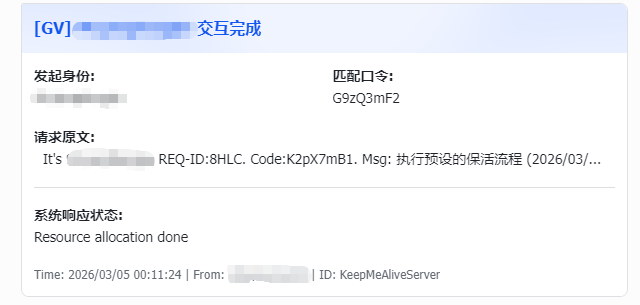

# Google Voice Auto-Keepalive (GVA) 🚀

一套基于 **Google Apps Script (GAS)** 的轻量化双向保活系统。通过模拟真实的短信交互逻辑，并集成飞书机器人推送，确保您的 Google Voice 号码永久处于活跃状态。

## 🌟 核心特性

- **角色互斥逻辑**：区分 `Client`（发起端）与 `Server`（响应端），通过 `REQ-ID` 与 `RES-ID` 指纹防止死循环。
- **智能寻址**：自动解析 GV 动态加密邮件网关，无需手动配置复杂的虚拟邮箱地址。
- **安全机制**：内置 32 组随机口令验证 + 飞书关键词校验。
- **自然语料**：100 条均衡分布的中英文语料库（50 中 / 50 英），模拟人类真实对话。
- **交互卡片**：飞书实时推送卡片通知，包含发起者身份、匹配口令及原文预览。

------

## 🌬️ 破冰步骤：建立首次连接 (Critical)

由于 GV 的邮件网关地址是动态生成的，脚本在首次运行时，Gmail 中没有历史记录，无法“寻址”。**必须手动执行破冰。**

### 场景 A：从 Client 端发起 (最推荐)

1. **手动发短信**：登录 **Client 账号** 的 GV App 或网页，向 **Server 账号** 号码发送：

   > `It's 99.Init REQ-ID:START Code:V9pX7mN2 破冰测试`

2. **Server 处理**：在 GAS 编辑器中手动点击运行一次 `KeepMeAliveServer` 函数。

   - **预期结果**：Server 会识别该短信并自动回复。此时飞书应弹出蓝色通知卡片。

3. **Client 激活**：在 GAS 中手动运行一次 `KeepMeAliveClient`。

   - **预期结果**：Client 搜到 Server 的回复（带 `RES-ID`），成功提取网关地址，并发出第一封正式请求。

### 场景 B：从 Server 端发起

1. **手动发短信**：登录 **Server 账号** 的 GV，向 **Client 账号** 号码发送：

   > `Hi 99.User, status recorded: 初始化链路 (Code:V9pX7mN2) RES-ID:INIT`

2. **Client 激活**：手动运行 `KeepMeAliveClient`。

   - **预期结果**：脚本通过 `RES-ID` 抓取到发件人地址，并开始周期性发信。

------

## 🛠️ 部署指南

### 1. 飞书机器人配置

- 在飞书群添加“自定义机器人”。
- **安全设置**：勾选“自定义关键词”，添加：`KeepMeAliveServer`。
- **关闭**“签名校验”与“IP白名单”。
- 复制 Webhook 地址。

### 2. 脚本部署

1. 进入 [GAS 控制台](https://script.google.com/)，创建两个项目：`GV_Client` 和 `GV_Server`。
2. 将对应的 `client.js` 和 `server.js` 粘贴进去。
3. 在 `server.js` 配置区填入您的飞书 Webhook 地址。
4. **手动授权**：点击“运行”，根据 Google 提示完成所有权限授权（点击“高级” -> “转到项目”）。

### 3. 设置触发器 (Triggers)

点击 GAS 左侧时钟图标：

- **Server**: 每小时执行一次 `KeepMeAliveServer`。
- **Client**: 每 7 天（或按需）执行一次 `KeepMeAliveClient`。

------

## 📝 角色指纹说明

| **标签** | **含义** | **搜索逻辑**                                                 |
| -------- | -------- | ------------------------------------------------------------ |
| `REQ-ID` | 请求标识 | **Server** 搜此标签进行回复；**Client** 搜地址时排除此标签。 |
| `RES-ID` | 响应标识 | **Client** 靠此标签提取网关地址；**Server** 搜请求时排除此标签。 |

------

## 📊 日志参考

通过 GAS 的“执行记录”可观察详细流程：

- `[Client寻址] 成功定位地址: 1234.5678.abcd@txt.voice.google.com`
- `[Server成功] 处理请求: 99.UserA | 地址: 5678.1234.dcba@txt.voice.google.com`
- `[飞书日志] 响应内容: {"code":0,"msg":"success"}`

## 服务侧增加飞书通知功能

## 我的服务器

如果没有Server，可以使用我的GV，通过网页或app向 ‪(512) 337-9669‬ 发送，一小时自动回复一次。
   > `It's 99.Init REQ-ID:START Code:V9pX7mN2 破冰测试`

Client收到回复后，后续脚本会自动获取网关地址自动发送，也可以在GAS控制台中手动执行一次脚本测试。
